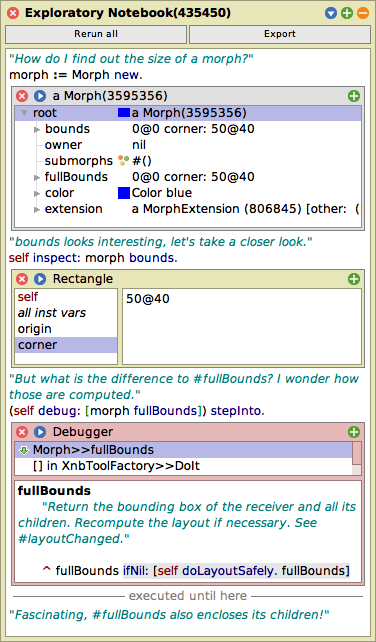

# Exploratory Notebooks

> Share your exploratory session as a literate notebook, including embedded inspectors and debuggers

<p align="center">
   <a href="https://hpi-swa-lab.github.io/exploratory-notebooks/?nb=simple.xnb.html" target="_blank">
      
   </a>
</p>

## Installation

1. [Get a recent Squeak Trunk image](https://squeak.org/downloads/) (tested with Squeak 6.1Alpha #23575)
2. Do the following:

   ```smalltalk
   Metacello new
   	baseline: 'ExploratoryNotebooks';
   	repository: 'github://hpi-swa-lab/exploratory-notebooks:main';
   	get; "for updates"
   	load.
   ```

   Alternatively, use `load: #experimental` to install advanced tracking support for immediate objects. (This will patch several methods in the base system.)
3. Open an example notebook:

   ```smalltalk
   XnbWorkspace openExample.
   ```

   Alternatively, you can also download one of the [example notebooks](./demo/) and drop it into the Squeak image.

> [!NOTE]  
> To reproduce the `testTerminateEverywhere` notebook, you must load `Kernel-jar.1633` from trunk **before** installing this project:
> 1. In the main docking bar, open *Apps* > *Monticello Browser*
> 2. In the package list, select `Kernel`
> 3. In the repository list, select `https://source.squeak.org/trunk`
> 4. Press *Open*
> 5. In the version list, select `Kernel-jar.1633`
> 6. Press *Load*

## Usage

> [!TIP]
> For a quick start, run `XnbWorkspace openExample` and follow the quick in-image tutorial.

### Recording a Notebook

- Create a new notebook via <kbd>Apps</kbd> > <kbd>Exploratory Notebook</kbd>.
- Start your exploration by running do-its, inspect-its, debug-its, etc. in the new notebook or any other tools. From the opened tools, you may open further tools, e.g., by navigating through an explorer, spawning more inspectors, stepping through a debugger, etc.
- When you want to record an artifact, press the copy icon in the title bar of its tool window. This will add a copy of the tool to the notebook, prepended by all do-its that were necessary to create this artifact.
- You can also add manual experiments and tool invocations to the notebook, as well as comments to document your findings. Press <kbd>Cmd</kbd> + <kbd>P</kbd> to execute a cell in the notebook.
- Press the <kbd>Export</kbd> button to save your notebook to a `.xnb.html` file.

### Loading a Notebook

- You can open a notebook by dragging it into the world or by using the File List from the Tools menu.
- Revitalize the notebook by rerunning it through the <kbd>Rerun all</kbd> button.
- You can also rerun the notebook up to a certain artifact by pressing the run icon at its top left corner.
- Press the expand icon at the top of any tool to spawn a copy of it in the world.
- Like in regular workspaces, you can also inspect variables or perform debug-its etc. from the notebook.

## Web Viewer

You can also view and interact with exploratory notebooks on the web: <https://hpi-swa-lab.github.io/exploratory-notebooks>. Press <kbd>Choose File</kbd> to explore a shared `.xnb.html` file or use the drop-down menu to browse sample notebooks. By clicking on any tool, you can run the notebook in the browser using SqueakJS.

## Citing

> Christoph Thiede, Tom Beckmann, Marcel Taeumel, and Robert Hirschfeld. 2026. **Literate Exploratory Programming for Asynchronous Collaboration.** In *Companion Proceedings of the 9th International Conference on the Art, Science, and Engineering of Programming* (*<Programming>’26 Companion*), March 16–20, 2026, Munich, Germany. ACM, New York, NY, USA, 11 pages. To appear.

<details>
<summary>BibTeX</summary>
<pre><code>@inproceedings{thiede2026literate,
	author = {Thiede, Christoph and Beckmann, Tom and Taeumel, Marcel and Hirschfeld, Robert},
	title = {Literate Exploratory Programming for Asynchronous Collaboration},
	year = {2026},
	month = {3},
	day = {16--20},
	publisher = {Association for Computing Machinery},
	address = {New York, NY, USA},
	booktitle = {Companion Proceedings of the 9th International Conference on the Art, Science, and Engineering of Programming},
	location = {Munich, Germany},
	series = {Onward! 26},
	note = {To appear}
}</code></pre>
</details>
